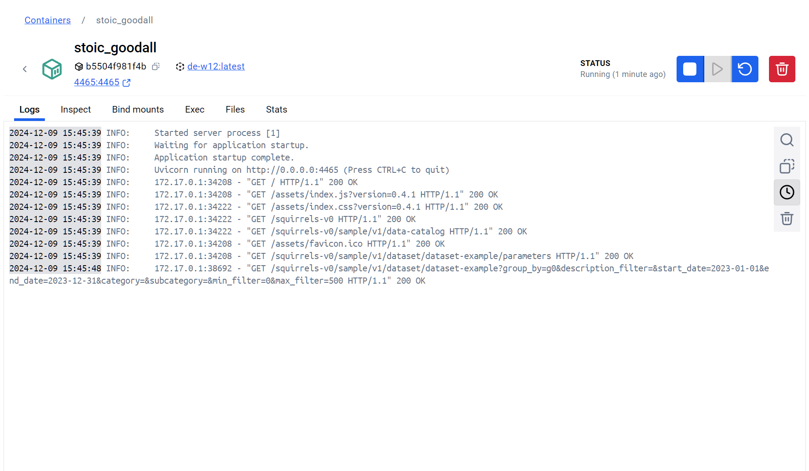

[](https://github.com/cpyang123/DE-W12/actions/workflows/test.yml)

# DE-W12 Squirrels Project in Docker Container


Hosted by default at http://localhost:4465/




Building the Container and Image:

1. Build the container, requirements should be installed automatically:

```{bash}
docker build -t de-w12 . 
```

2. Run it:
```{bash}
docker run -d -p 4465:4465  de-w12
```

Feel free to change host and ports as needed in the Docker File

You should be able to see the exposed Squirrels API at http://localhost:4465/